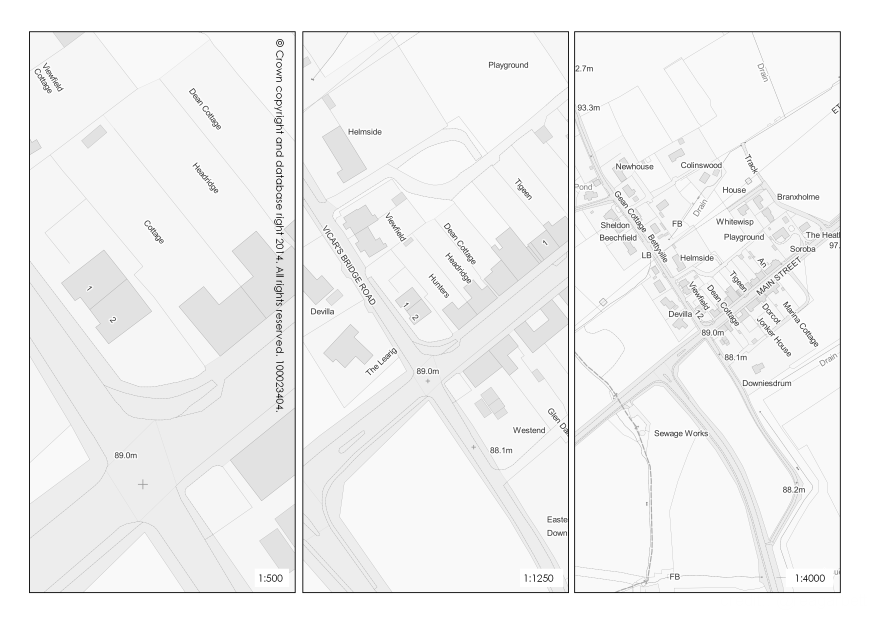
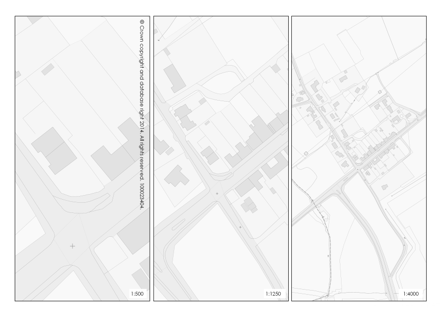

**OS MasterMap Greyscale**

QML files for OS MasterMap loaded into PostGIS using GoLoader.  The greyscale colours produced here are derived from the full colour MasterMap pallette and produce quite strong shades of grey (if that's the correct term).  I am working on producing a set of greyscale QML derived from the backdrop colour pallette which should present a softer base map similar to my VectorMap Local and District greyscale styles.

The QML files above with the "_lightgs" suffix are based on the backdrop style colours.  See the images below.

During the loading process the following fields are created that are used in the styling process.

For _area_ and _line_ features:

* descriptive_group
* descriptive_term
* featurecode
* make
* osmmstyle_name
* osmmstyle_number

In addtition, for _annotation_ features:

* textrendering_anchorposition
* textrendering_font
* textrendering_height
* textrendering_orientation
* text_string (or textstring)

The formula for luminosity used to convert the colour to greyscale is as follows:

Multiply the RGB values by the weighted values and sum the result

R x 0.2126 + G x 0.7152 + B x 0.0722 = Y

Create a greyscale RGB value like RGB(Y, Y, Y) and use that to replace the colour value in your QML/SLD file.
