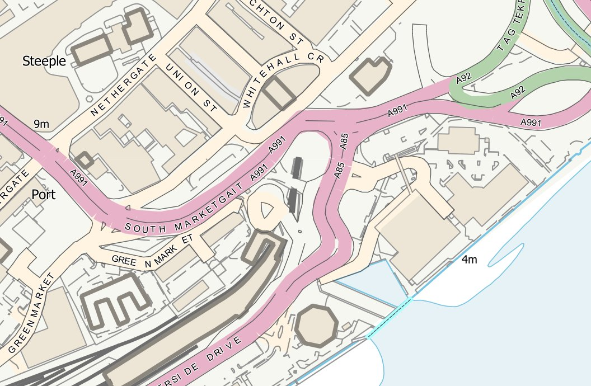
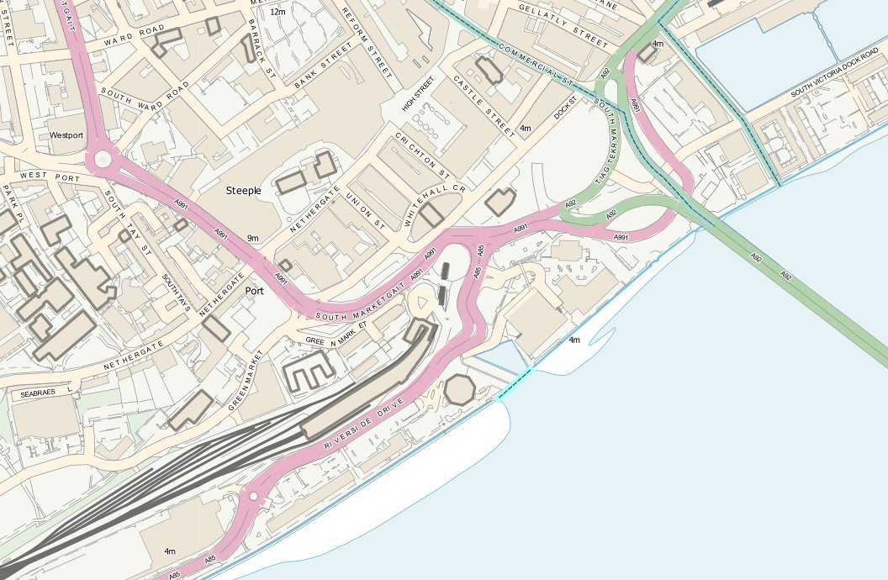
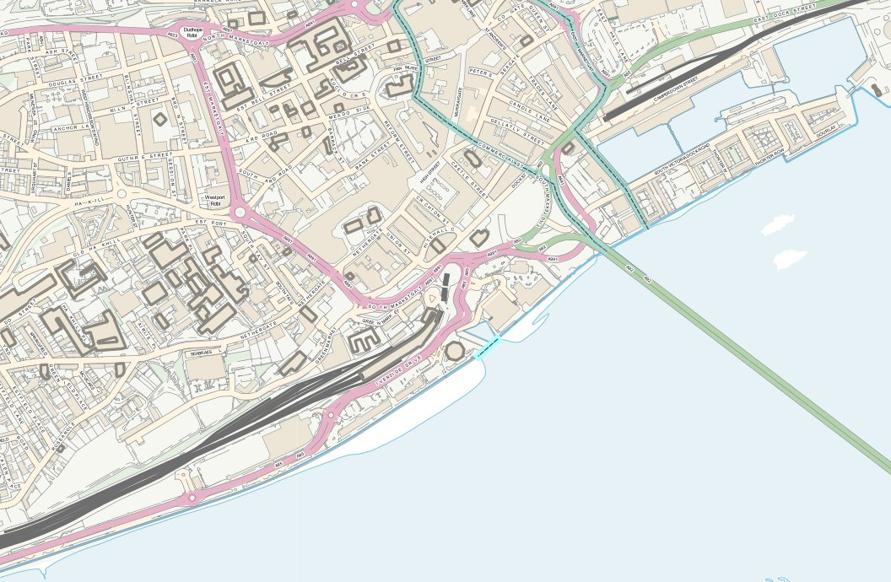

Ordnance Survey VectorMap Local
===============================

QGIS QML style files created in QGIS 2.0 for VectorMap Local tables stored in PostGIS and created with Snowflake's GoLoader software.  This means that there are fields for text font, text height, text orientation, text position which work perfectly with the data driven definitions in the layer properties.

These styles were hacked together from the OS guidance for VectorMap Local and the provided SLDs.  See the following link for more information: http://www.ordnancesurvey.co.uk/business-and-government/help-and-support/products/vectormap-local.html

