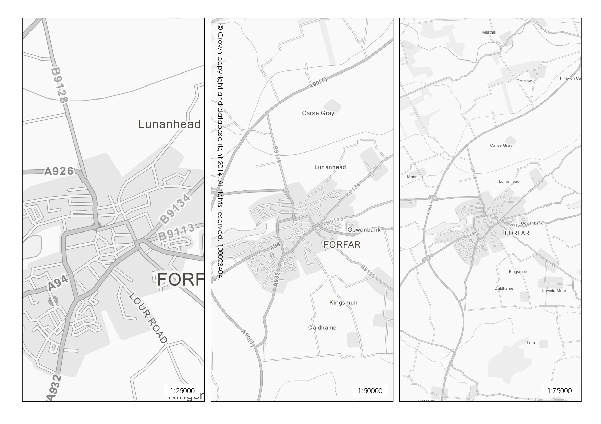

Ordnance Survey Meridian2 Greyscale
===================================

The formula for luminosity used to convert the colour to greyscale is as follows:

Multiply the RGB values by the weighted values and sum the result

R x 0.2126 + G x 0.7152 + B x 0.0722 = Y

Create a greyscale RGB value like RGB(Y, Y, Y) and use that to replace the colour value in your QML/SLD file.
