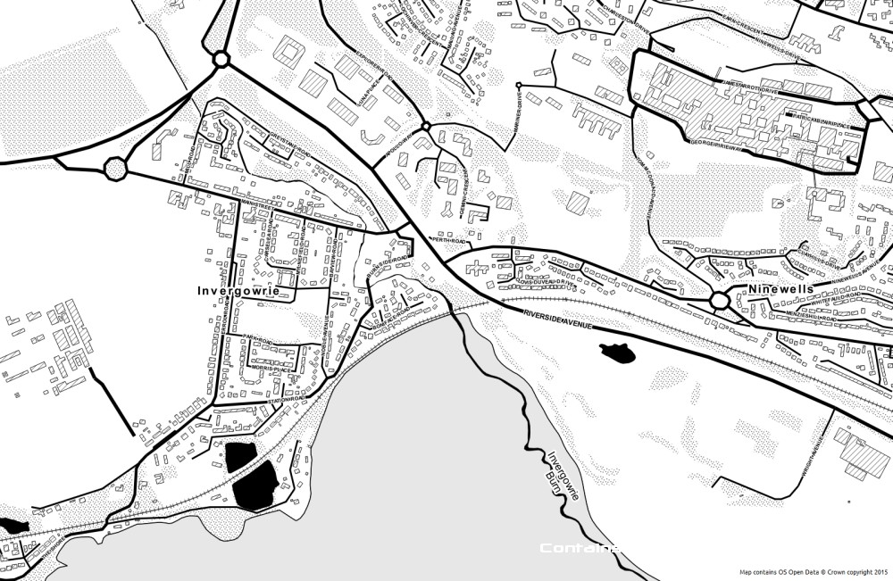
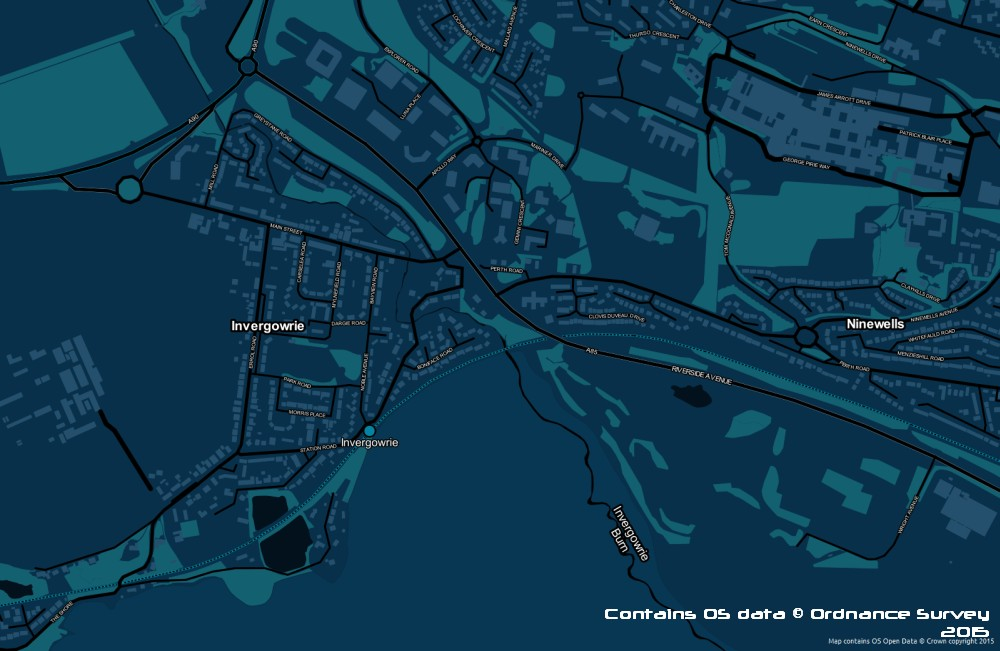
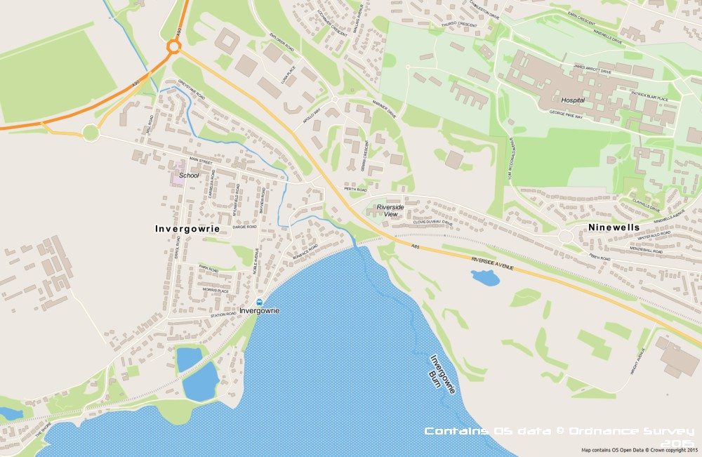
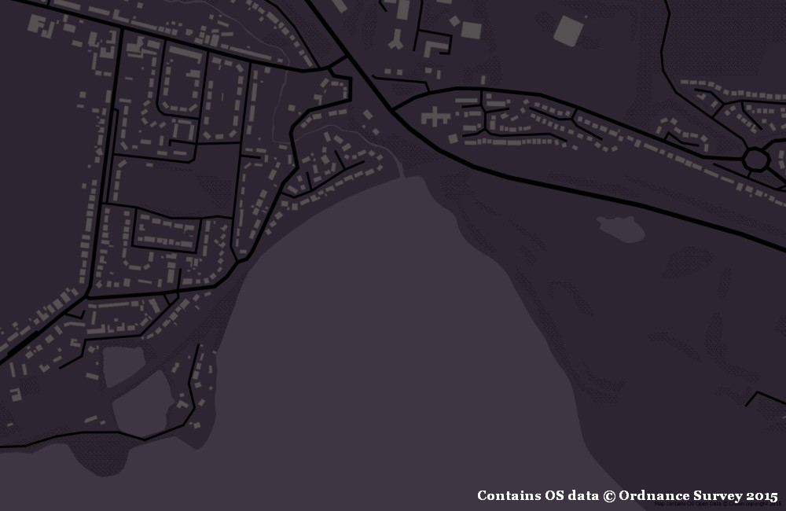
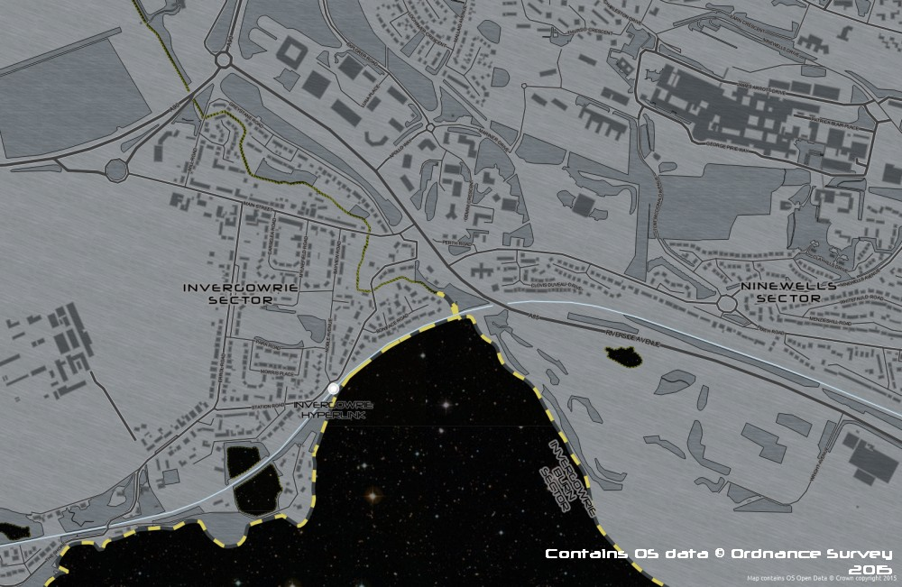

## Style sheets for OS Open Map

Styles for shapefiles and shapefiles loaded into PostgreSQL.  More information about the data is available [here](http://www.ordnancesurvey.co.uk/business-and-government/products/os-open-map-local.html).

## Toner-like Stylesheets

Created from the OS stylesheets and applied to the downloaded shapefiles

## Midnight Commander-like stylesheets

Set the background colour in your QGIS project to #08304a (RGB 8 48 74)

Inspired by http://polymaps.org/ex/midnight-commander.html#14.58/37.7683/-122.4616

## Crisp style

Set your background colour to #fcf4e9 (RGB 252 244 233)

## Spring style

Set your background colour to #eee8e2 (RGB 238 232 226)

## Brinjal style

Set your background colour to RGB 46 37 50 

## Camper style

Set your background colour to 

## Recommended layer order (not all styles use all layers)
* electricity transmission line
* motorway junction
* named place
* roundabout
* railway station
* road fill
* road casing (duplicate the roads layer)
* road tunnel
* railway track
* railway tunnel
* surface water line
* important building
* building
* glasshouse
* functional site
* tidal boundary
* foreshore
* surface water area
* tidal water
* woodland

